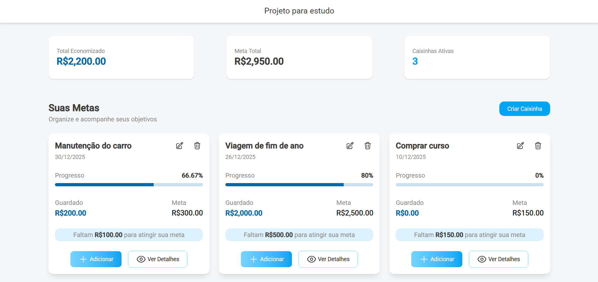
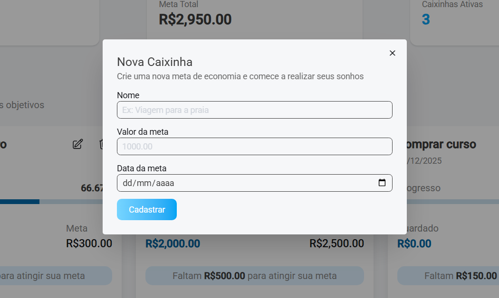
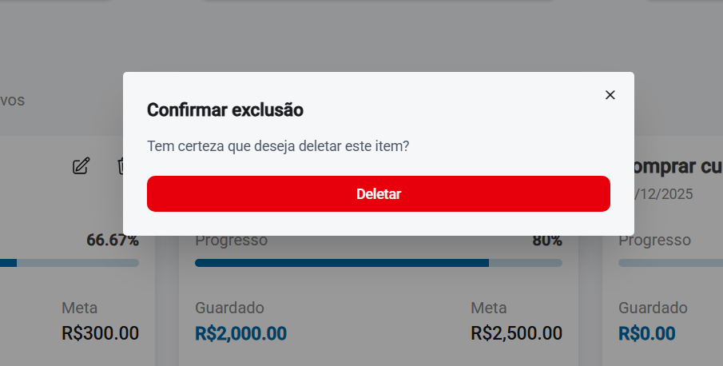

# 💰 Projeto de Metas Financeiras (Estudo)

Este projeto foi desenvolvido com foco em **aprendizado**. 

## 🛠️ Detalhes Técnicos e Conceitos Aplicados

 Foi construído utilizando as seguintes funcionalidades chave do **Angular 20**:

* **Signals:** Adotados para gerenciamento de **estado reativo** granular, garantindo que a detecção de mudanças seja precisa e direcional, otimizando a performance.

* **Computed Signals (Sinais Derivados):** Utilizados para criar valores reativos baseados em outros *Signals*.

* **Template-Driven Forms:** Padrão de formulário simples implementado para a interface de criação e edição, utilizando diretivas do Angular no template.

* **Pipes:** Empregados para a **transformação e formatação** declarativa da apresentação de dados (e.g., moedas, datas) nos templates.

* **HttpClient:** Para fazer requisições.

* **Zoneless:** A aplicação opera sem o `Zone.js`, eliminando o **mecanismo de detecção de mudanças automático global** que monitorava todas as operações assíncronas.

---

---
# 🔍 Funcionalidades

## ➕ Criar Meta

---
O formulário de criação de metas utiliza **template-driven forms**

O usuário pode registrar uma meta financeira informando:
- **Nome da meta**
- **Valor alvo**
- **Data alvo**
- **Descrição opcional**

Foram adicionadas validações nos campos essenciais.
---
## 📝 Editar Meta
Permite modificar qualquer informação previamente cadastrada em uma meta.

## ❌ Excluir Meta
O usuário pode remover metas cadastradas de forma simples e direta.

